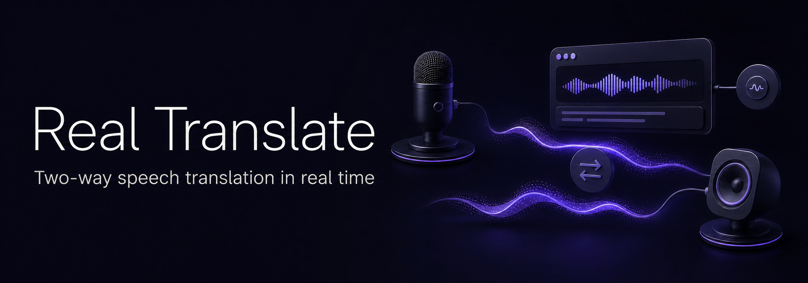

<p align="right">
  <strong>English</strong> · <a href="./README.ru.md">Русский</a>
</p>

<p align="center">
  <a href="https://orcestr.com">
    
  </a>
</p>

# Orcestr Real Translate

[](https://github.com/Artasov/orcestr-real-translate/actions/workflows/ci-release.yml)
[](https://v2.tauri.app/)
[](./LICENSE)

Native two-way speech transcription and translation for live conversations.

Orcestr Real Translate independently captures a microphone, system audio, or both. Each direction
can produce a live transcript, translate speech into a selected language, and optionally play the
translated voice through its own audio output. Transcript history exists only for the lifetime of
the application process.

Main website: [orcestr.com](https://orcestr.com)

## Status

| Item | Value |
| --- | --- |
| Product | Orcestr Real Translate |
| Version | `0.1.0` |
| Status | Beta |
| Desktop runtime | Tauri 2 / Rust 2021 |
| Interface | React 19 / TypeScript / `@orcestr/ui` |
| Platforms built by CI | Windows x64, universal macOS (Apple Silicon + Intel), Linux x64 |

The application and its Realtime contracts are under active development. Do not treat the current
configuration schema or release channel as stable until the first stable release.

## Capabilities

| Area | Behavior |
| --- | --- |
| Microphone | Captures the selected input and enhances speech before recognition |
| System audio | Native WASAPI process loopback on Windows, ScreenCaptureKit on macOS, and the default PulseAudio/PipeWire monitor on Linux |
| Transcription | Streams recognized source text with low latency |
| Translation | Streams source text, translated text, and translated PCM audio |
| Spoken output | Can be enabled or muted independently for each channel, including during a live session |
| Transcript | Can be copied or cleared and is discarded when the app closes |
| Routing | Uses independent input and translated-audio output devices per direction |
| Authentication | Supports Orcestr email/password and OAuth public-client flows |

## Audio pipeline

```text
microphone ─┐
            ├─ capture → RNNoise → adaptive gain → compressor → 24 kHz PCM16 → OpenAI Realtime
system audio┘                                                                  │
                                                                                ├─ source transcript
                                                                                ├─ translated transcript
                                                                                └─ optional native playback
```

The native speech enhancer uses voice-aware RNNoise suppression, an adaptive noise floor, automatic
gain, compression, a high-pass filter and a limiter. Feedback validation rejects translated-output
routes that would be captured again by the active system-audio channel. Muted translation remains
text-only and does not require an output device.

On macOS 13 or newer, the first system-audio session requests **Screen & System Audio Recording**
permission and the app must be restarted after the grant. ScreenCaptureKit excludes this app's own
playback, so translated speech may use the same physical output. Linux uses the PulseAudio protocol
provided by PulseAudio or PipeWire. Because that monitor cannot exclude one client reliably, the
app blocks translated playback into the monitored default sink; choose a separate output or disable
spoken output for the system channel.

## Privacy and security

- The OpenAI API key is entered in **Settings** and stored in the operating-system credential store.
  It is never written to `.env` or browser storage and is never returned to the renderer.
- Access tokens remain in native process memory. Refresh credentials use the OS keyring under the
  application service identifier.
- Raw audio stays in the Rust process and is sent directly to the configured OpenAI Realtime endpoint.
  The renderer receives only bounded status, meter and transcript events.
- The OAuth client is public: it embeds no client secret and uses PKCE, exact state validation and the
  registered `com.orcestr.realtranslate://oauth/callback` deep link.
- Transcript text is session-only React memory. Closing the application discards it naturally.

See [SECURITY.md](./SECURITY.md) before reporting a vulnerability or changing an authentication,
credential, audio-routing, updater or release boundary.

## Orcestr ecosystem

| Project | Responsibility |
| --- | --- |
| [Orcestr Auth](https://github.com/Artasov/orcestr-auth) | Shared login forms, browser OAuth and desktop public-client contracts |
| [Orcestr UI](https://github.com/Artasov/orcestr-ui) | Components, interaction patterns and visual tokens |
| [Orcestr Core](https://github.com/Artasov/orcestr-core) | Shared transport and error contracts |
| [Orcestr](https://github.com/Artasov/orcestr) | Product backend, OAuth registration and account services |

## Local development

The authentication repository must be a sibling because the app builds its local packages before
installing the desktop workspace:

```text
dev/
├── orcestr-auth/
└── orcestr-real-translate/
```

```powershell
npm run deps:install
npm run dev
```

After signing in, open **Settings**, save an OpenAI API key and select the capture/playback devices.
Production endpoints are compiled in by default. `.env.example` documents the explicit debug-only
localhost override accepted by native configuration validation.

The `.run` directory includes locked dependency installation, development, build, targeted test and
version-bump configurations for JetBrains IDEs.

## Checks

```powershell
npm run version:check
npm run typecheck
npm test
npm run test:tooling
npm run build:renderer
npm run test:rust
```

`npm run check` runs that complete repository check sequence. See
[CONTRIBUTING.md](./CONTRIBUTING.md) for change-specific expectations.

## CI and releases

GitHub Actions runs only when a `vX.Y.Z` tag is pushed. Ordinary pushes and pull requests do not
start the release pipeline. Before a tag is created, the local release commands check synchronized
versions, TypeScript, renderer tests, release tooling, the production renderer build and Rust unit
tests. They create a release branch and PR, squash-merge it into `main`, and publish the tag only
after the merge is confirmed. The tag builds Windows (`nsis`, `msi`), macOS (`app`, `dmg`) and Linux
(`AppImage`, `deb`) bundles.

Create a release with `.run/patch.run.xml`, `.run/minor.run.xml` or `.run/major.run.xml`, or run:

```powershell
npm run release:patch
npm run release:minor
npm run release:major
```

Release artifacts and Tauri updater signatures are published to immutable versioned S3 prefixes.
The mutable `latest.json` channel is promoted only after every platform artifact has been verified.
Platform jobs upload directly to S3; GitHub Actions artifacts and GitHub Release assets are not used.
The GitHub Release contains S3 download links only.
Release CI pins the exact Orcestr Auth revision and requires the tagged commit to be contained in
`origin/main` before signing or storage credentials are exposed.

Configure these **Repository variables** before pushing the first release tag:

| Variable | Value for the current Orcestr storage |
| --- | --- |
| `S3_REGION` | `ru-1` |
| `S3_ENDPOINT_URL` | `https://s3.twcstorage.ru` |
| `S3_BUCKET` | `324718a4-2cc5dd7a-917b-4e82-87c5-b9d5f8de16ba` |
| `S3_PUBLIC_BASE_URL` | `https://s3.twcstorage.ru/324718a4-2cc5dd7a-917b-4e82-87c5-b9d5f8de16ba/` |

Configure these **Repository secrets**:

| Secret | Purpose |
| --- | --- |
| `S3_ACCESS_KEY_ID` | Timeweb S3 access key with read/write access to the release prefix |
| `S3_SECRET_ACCESS_KEY` | Matching Timeweb S3 secret key |
| `TAURI_SIGNING_PRIVATE_KEY` | Tauri updater private key matching the public key in `tauri.conf.json` |
| `TAURI_SIGNING_PRIVATE_KEY_PASSWORD` | Password for the updater key; omit it when the key is not encrypted |

The signing key is not issued by Tauri, GitHub, or S3. Generate a dedicated Real Translate key pair
once, locally, from the project root in PowerShell:

```powershell
New-Item -ItemType Directory -Force "$env:USERPROFILE\.tauri" | Out-Null
npx tauri signer generate -w "$env:USERPROFILE\.tauri\orcestr-real-translate.key"
```

The command asks you to choose a password and creates the private
`orcestr-real-translate.key` file and public `orcestr-real-translate.key.pub` file.

- Commit the `.key.pub` contents as `plugins.updater.pubkey` in `src-tauri/tauri.conf.json`.
- Add the complete `.key` contents only to the GitHub Actions secret
  `TAURI_SIGNING_PRIVATE_KEY`; never commit it.
- Add the password chosen during generation to `TAURI_SIGNING_PRIVATE_KEY_PASSWORD`. Omit this
  secret when the key has no password.

`tauri.conf.json` contains the dedicated Real Translate public key. After the first release, keep
this key pair in a secure backup: losing the private key prevents already-installed builds from
accepting future updates.
`GITHUB_TOKEN` is supplied automatically by GitHub Actions and must not be added manually.
Successful release publication also promotes `downloads.json`, which powers the download buttons
on the Orcestr product landing.

## Repository policies

- [Contributing](./CONTRIBUTING.md)
- [Security policy](./SECURITY.md)
- [Code of Conduct](./CODE_OF_CONDUCT.md)
- [Brand and trademark use](./TRADEMARKS.md)

## Maintainer

Public updates are maintained by [@Artasov](https://github.com/Artasov).

## License

Licensed under the [Mozilla Public License 2.0](./LICENSE). Use, modification and commercial use are
permitted under the MPL's file-level conditions. Copyright and attribution notices must be preserved;
modifications to MPL-covered files remain subject to the MPL. The Orcestr names, product identity,
logos and visual assets are not licensed under the MPL. See [NOTICE](./NOTICE),
[TRADEMARKS.md](./TRADEMARKS.md) and [assets/README.md](./assets/README.md).
